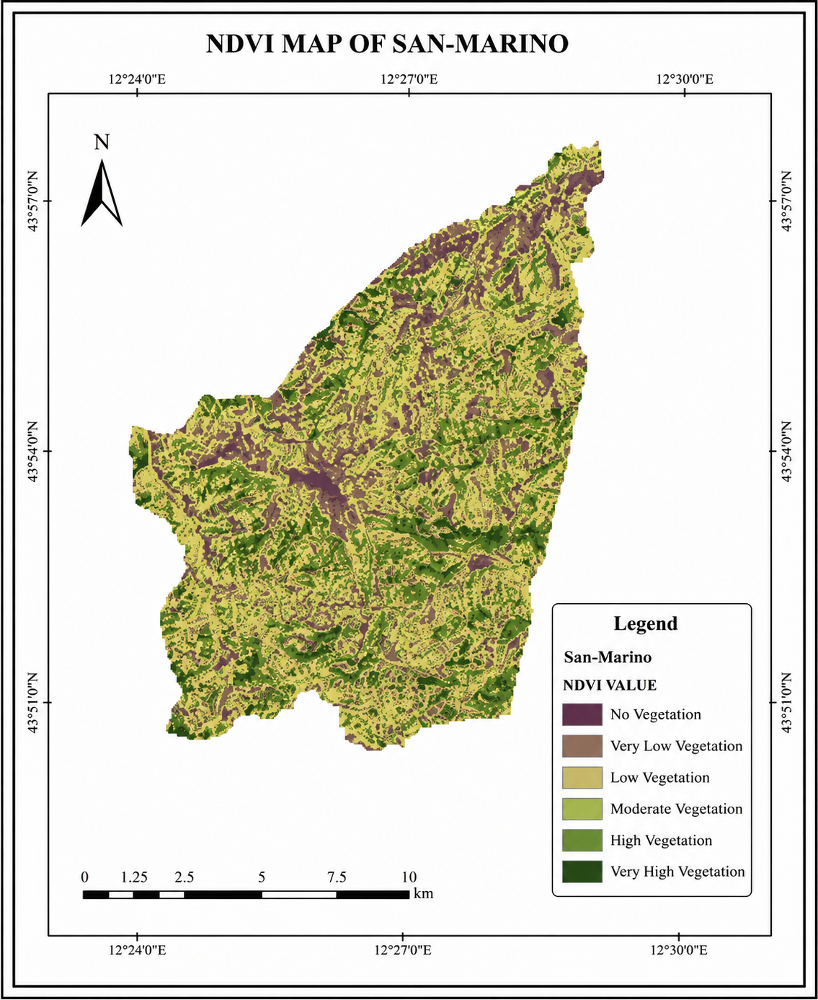
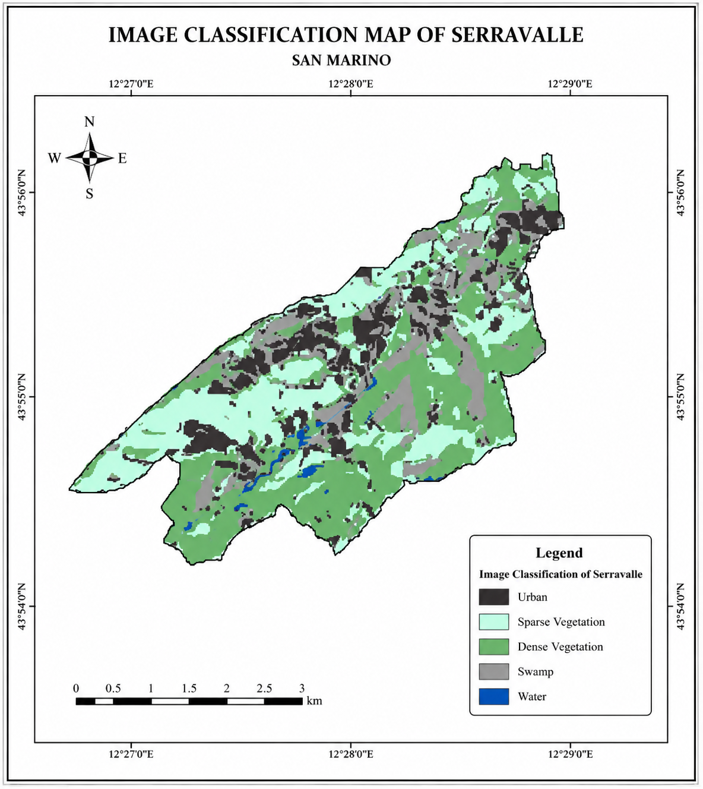
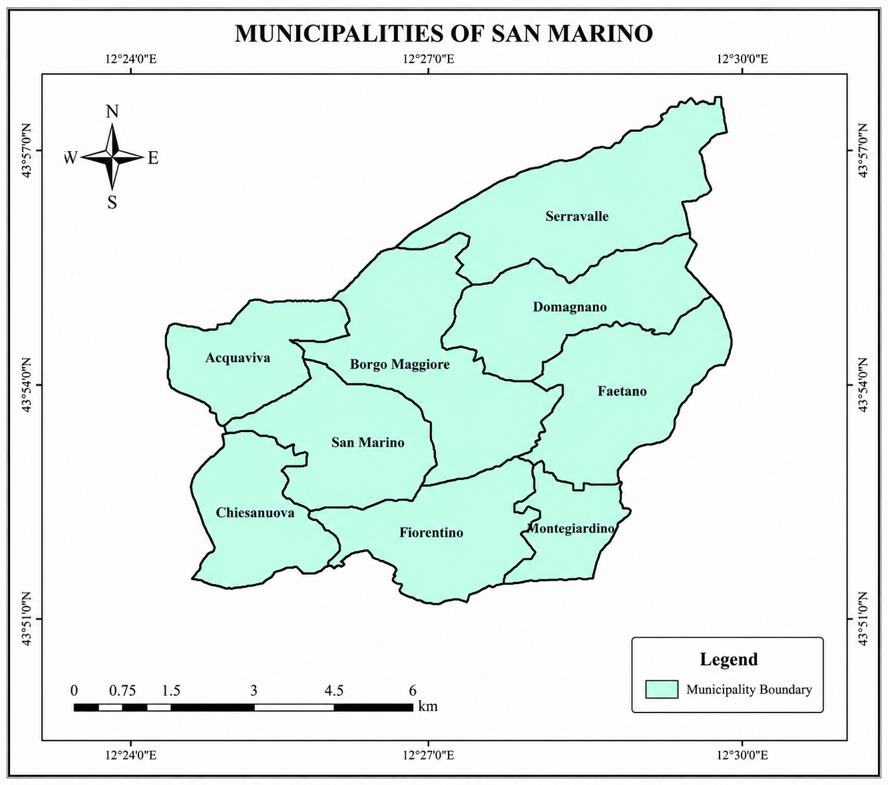
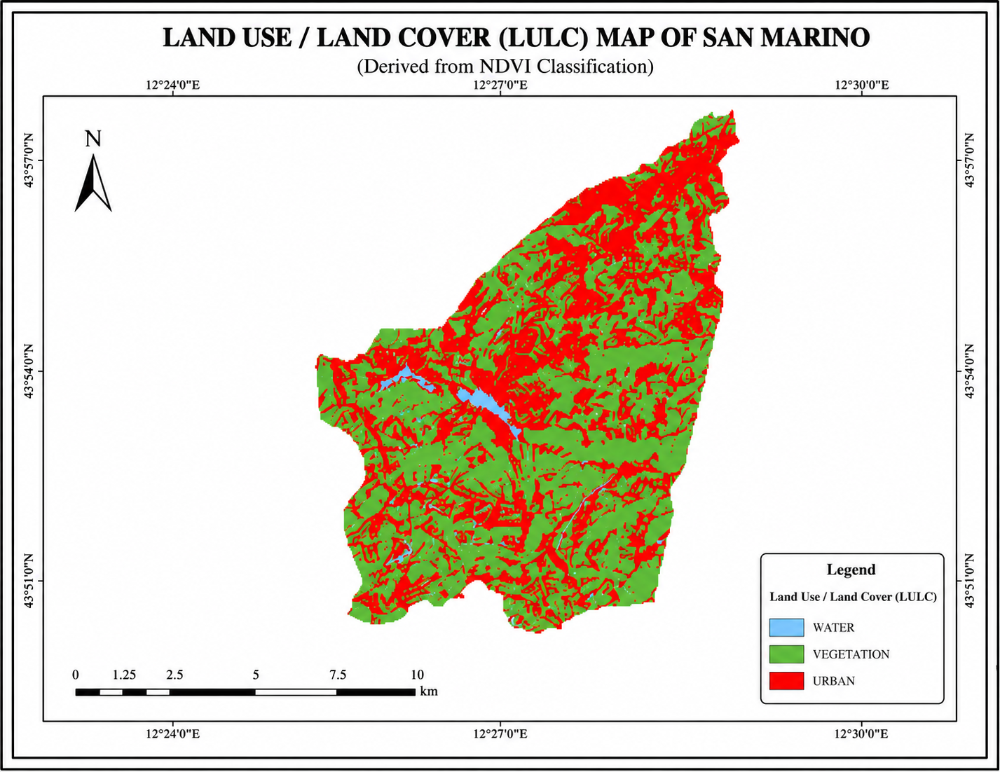

# 🗺️ GIS Analysis of San Marino — ArcGIS Project

> **Remote Sensing & Spatial Analysis using ArcGIS Pro**  
> Vegetation mapping, land cover classification, and municipal boundary analysis of the Republic of San Marino.

---

## 📌 Project Overview

This project applies **Remote Sensing** and **GIS techniques** in ArcGIS Pro to analyze land use, vegetation health, and spatial distribution across the Republic of San Marino. The study area covers all **9 municipalities** of San Marino and includes multi-layer analysis derived from satellite imagery.

### Key Objectives
- Assess vegetation health using **NDVI (Normalized Difference Vegetation Index)**
- Perform **supervised image classification** for land cover mapping in Serravalle
- Map **Land Use / Land Cover (LULC)** across San Marino derived from NDVI classification
- Digitize and visualize **municipal boundaries** for spatial context

---

## 🛠️ Tools & Software

| Tool | Purpose |
|------|---------|
| **ArcGIS Pro** | Main GIS platform for analysis and cartography |
| **Sentinel-2 / Landsat Imagery** | Source satellite data |
| **NDVI Band Calculation** | Vegetation index computation (NIR - Red) / (NIR + Red) |
| **Supervised Classification** | Maximum Likelihood / Random Forest classification |

---

## 🗺️ Maps Produced

### 1. NDVI Map of San Marino
Displays vegetation health across the entire country using six NDVI classes.



| Class | Description |
|-------|-------------|
| No Vegetation | Bare soil, built-up areas |
| Very Low Vegetation | Sparse or dry vegetation |
| Low Vegetation | Grasslands, shrublands |
| Moderate Vegetation | Mixed farmland/vegetation |
| High Vegetation | Dense forest edges |
| Very High Vegetation | Dense forest |

---

### 2. Image Classification Map of Serravalle
Supervised land cover classification of Serravalle municipality identifying 5 land cover types.



| Class | Description |
|-------|-------------|
| Urban | Built-up areas and settlements |
| Sparse Vegetation | Open land with light cover |
| Dense Vegetation | Forested and heavily vegetated zones |
| Swamp | Wetland/marshy areas |
| Water | Rivers, streams, and water bodies |

---

### 3. Municipalities of San Marino
Administrative boundary map displaying all 9 municipalities (castles) of San Marino.



Municipalities: Acquaviva, Borgo Maggiore, Chiesanuova, Domagnano, Faetano, Fiorentino, Montegiardino, San Marino, Serravalle

---

### 4. Land Use / Land Cover (LULC) Map of San Marino
LULC classification derived from NDVI analysis, categorizing the country into 3 primary land cover types.



| Class | Description |
|-------|-------------|
| Water | Lakes, reservoirs, river bodies |
| Vegetation | Forests, farmland, green spaces |
| Urban | Built-up, infrastructure, bare land |

---

## 📊 Key Findings

- The majority of San Marino is covered by **low-to-moderate vegetation**, typical of Mediterranean mixed-use landscapes
- **Urban expansion** is concentrated along the ridge corridors visible in the LULC map
- Serravalle shows significant **dense vegetation** with pockets of urban development
- **Swamp/wetland zones** are identifiable along valley floors in the classification map

---

## 📁 Repository Structure

```
arcgis-san-marino-gis/
 ├── maps/
 │   ├── ndvi_map_san_marino.png
 │   ├── image_classification_serravalle.png
 │   ├── municipalities_san_marino.png
 │   └── lulc_map_san_marino.png
 ├── README.md
 └── ENT PRESENTATION.pptx
```

---

## 🎓 Skills Demonstrated

- Remote Sensing & Satellite Image Processing
- NDVI Computation & Vegetation Analysis
- Supervised Image Classification
- Land Use / Land Cover (LULC) Mapping
- Cartographic Design & Map Layout in ArcGIS Pro
- Spatial Analysis & Municipal Boundary Digitization
- Legend Design & Professional Map Composition

---

## 👤 Author

**Samuel Turner**  
GitHub: [CYCLIC05](https://github.com/CYCLIC05)

---

*This project was completed as part of a GIS/Remote Sensing coursework using ArcGIS Pro and open-source satellite imagery.*
